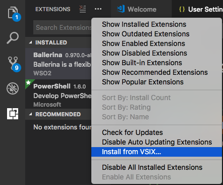
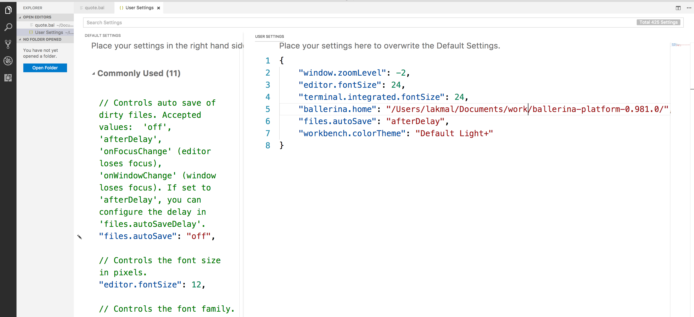
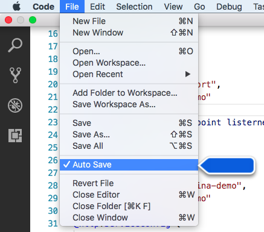

# Workshop - Cloud Native Programing with Docker, Kubernetes, and Ballerina

Docker and Kubernetes are key elements of modern cloud native deployment automations. After building your microservices, common practice is to create docker images and create YAML files to automate the deployment with Docker and Kubernetes. Writing these YAMLs, Dockerfile descriptors are really painful and error prone. 

[Ballerina](http://ballerina.io) is a new cloud native programing language which understands the architecture around it - the compiler is environment aware with microservices directly deployable into infrastructure like Docker and Kubernetes. 

In this workshop we will have hands-on sessions on following:
- [Hello World](./tutorial-01/) - Writing Hello World service
- [Annotation support](./tutorial-02/) - How to use annotation in your code
- [Docker Supoort](./tutorial-03/) - How to deploy your serive in a Docker container
- [Kubernetes Support](./tutorial-04/) - How to run your service in a K8S cluster
- [Connector Support](./tutorial-05/):
  - How to integrate your service with external service(Twitter) 
  - How to pass configurations to your service by using K8S ConfigMap. 
- [Data Integration](./tutorial-06/): 
  - How to integrate your serivce with Database. 
  - How to handle data security. 
  - How to add custom library files into our service Docker image
- [Microservice Integration and Composition](./tutorial-07/):
  - How to create a project
  - How to do microservice composition
  - How to deploy multi service application on K8S
- [Microservice Resiliency](./tutorial-08/):
  - How to add service resiliency 
  - How add ingress config
  
### Workshop duration and audience
Total time: 180 minutes depending on whether you type it all or copy from the pre-created script files, how fast you can do it, how many questions you get asked, and so on.

Target audience: technical: workshop, meetups, technical customers/partners - this is a dev-level workshop

# Prep / requirements

## Ballerina

Get the latest download from [ballerina.io](http://ballerina.io)

Currently tested on 0.981.0

Add Ballerina **bin** folder to your $PATH

Check it by opening the terminal window and running:

```
$ ballerina version
Ballerina 0.981.0
```

## VS Code

Install VS Code: [https://code.visualstudio.com/](https://code.visualstudio.com/)

Install Ballerina plug in into VS Code by importing the VSIX file:



Make VS Code fonts larger:

* On Windows/Linux - File > Preferences > Settings
* On macOS - Code > Preferences > Settings

You are provided with a list of Default Settings. Copy any setting that you want to change to the appropriate settings.json file. The following are recommended (the SDK path will be different on your computer) - obviously the font size is whatever works best on your particular screen in your particular room with your particular audience:

```
{
   "window.zoomLevel": 0,
   "editor.fontSize": 24,
   "terminal.integrated.fontSize": 24,
   "ballerina.home": "/Users/lakmal/Ballerina/distro/"
}
```



**IMPORTANT**:

* It is highly recommended that you set **Auto Save** in VS Code. It is very easy to forget to save the file before building and then wonder why your code is not working as expected.
 

## Docker and Kubernetes

If your on Mac install [Docker with Kubernetes](https://store.docker.com/editions/community/docker-ce-desktop-mac) 

If your on Windows install [Docker with Kubernetes](https://store.docker.com/editions/community/docker-ce-desktop-windows)

Alternatively you can use [minikube](https://github.com/kubernetes/minikube)

## Twitter

The workshop is using Twitter account to send tweets.

For your own Twitter account:

1. Set up the account (need to have a verified phone number in order to be used programmatically),
2. Go to [https://apps.twitter.com/](https://apps.twitter.com/)
3. Click the **Create New App** button and provide the info: 
4. In the app, go to the **Keys and Access Tokens** tab:
5. Generate keys and tokens if you have not done that so.
6. In your demo folder, create file **twitter.toml** and put the keys and tokens that you get from the twitter apps UI:

```
# Ballerina workshop demo config file
clientId = ""
clientSecret = ""
accessToken = ""
accessTokenSecret = ""
```

## Curl

Download from: [https://curl.haxx.se/download.html](https://curl.haxx.se/download.html) 

